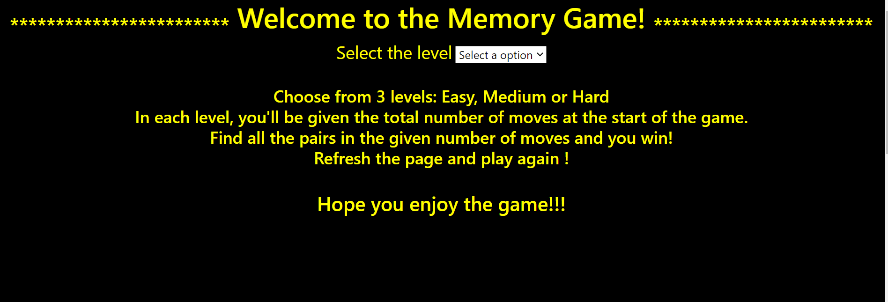
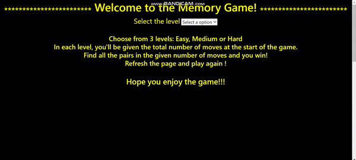
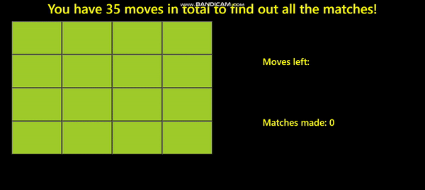
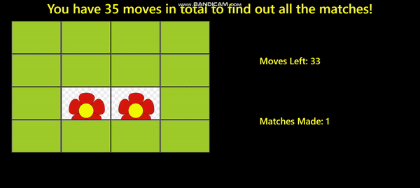
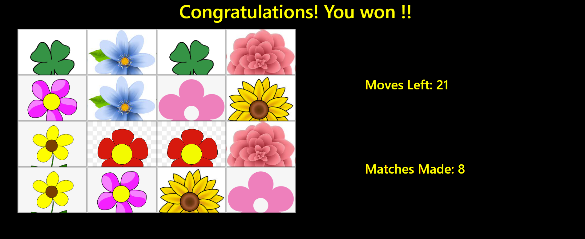
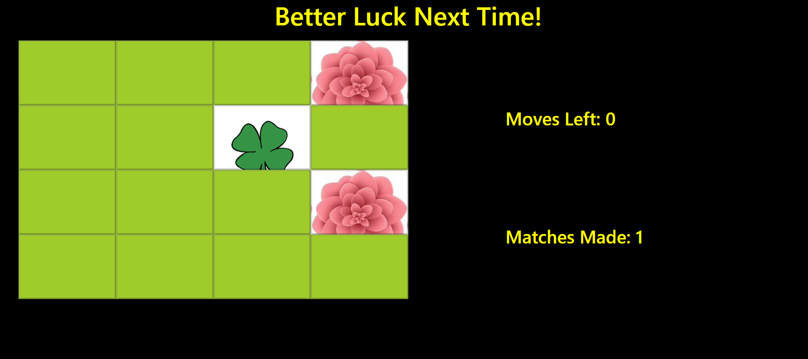

# Memory-Game
This was my first project as a front-end developer. I have tried to replicate one of our favourite childhood games : The Memory Game. 
Rules of this game are pretty simple: the player has to find all the hidden pairs in a certain given number of moves.

<b>There are 3 levels in this game that I designed: "Easy", "Medium" and "Hard". They differ in number of moves available and number of tiles to be flipped.</b>

<h3>Technologies Used</h3>
<li> HTML</li>
<li>CSS</li>
<li> Javascript</li>

<h3> Preview </h3>
Below are some of the snapshots of the game:
 The First page:

These gifs explain the basic working of the webpage:
 
 
 
 At game end:
 If the player wins:

If the player loses:

<h3>How to Run</h3>
Pull/Download the "Memory Game" folder into your desired directory and open the file named "memory_game.html" into your browser.
That's it! You canplay and enjoy anytime!!
